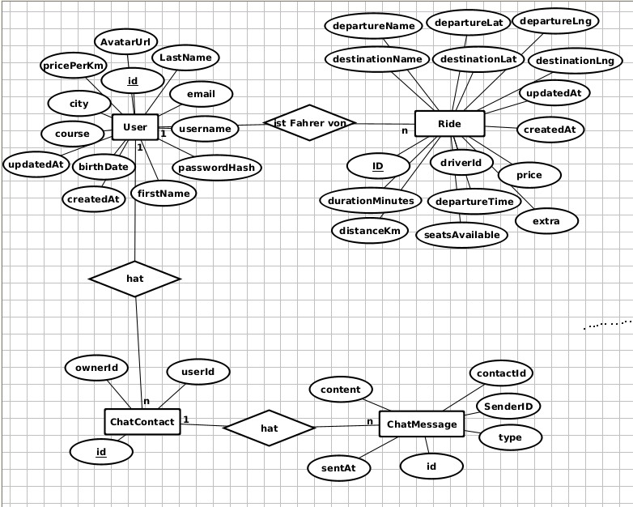
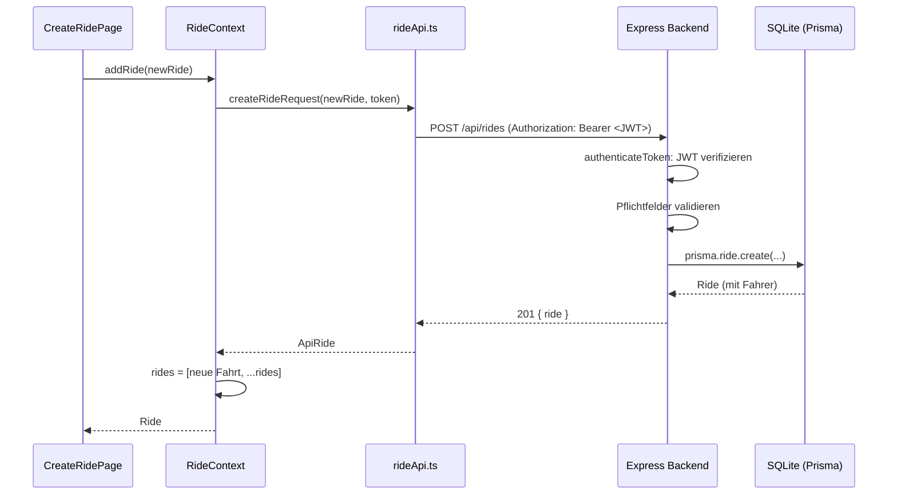
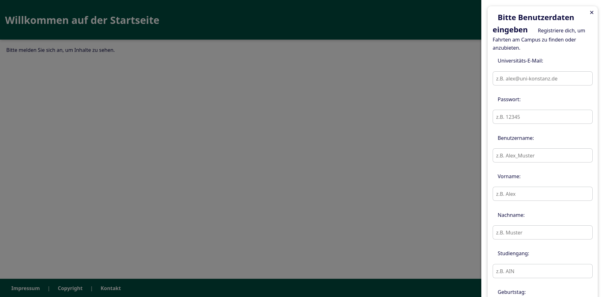
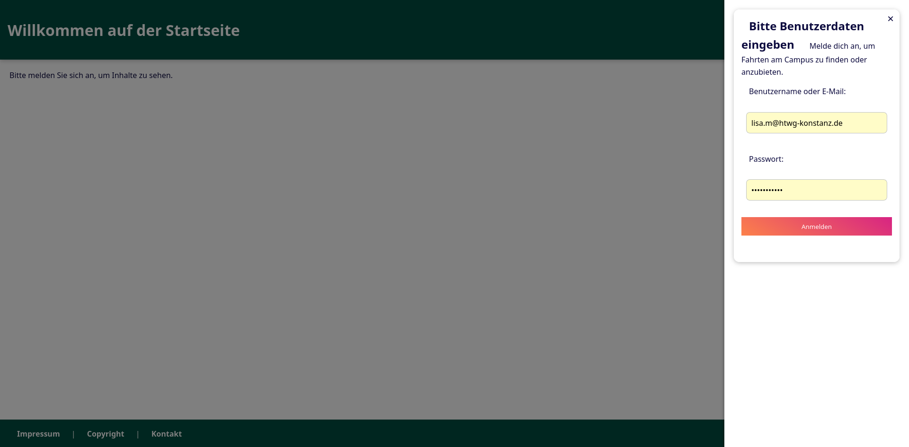
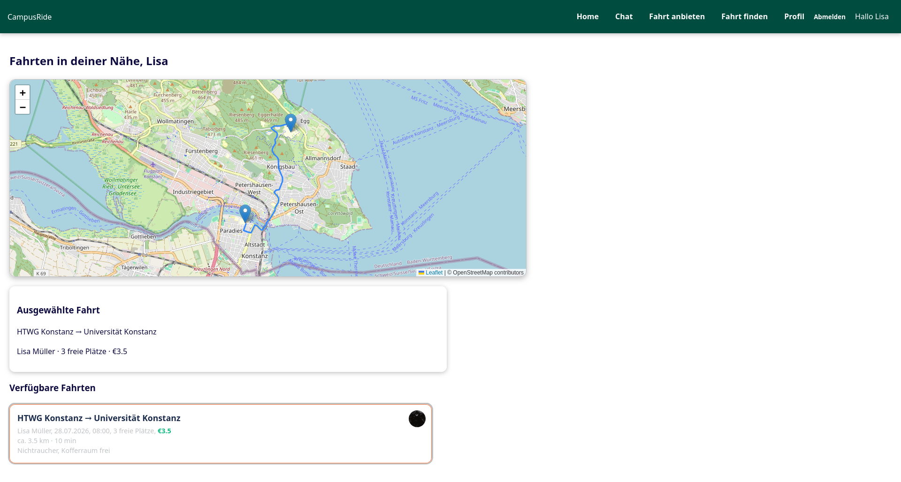
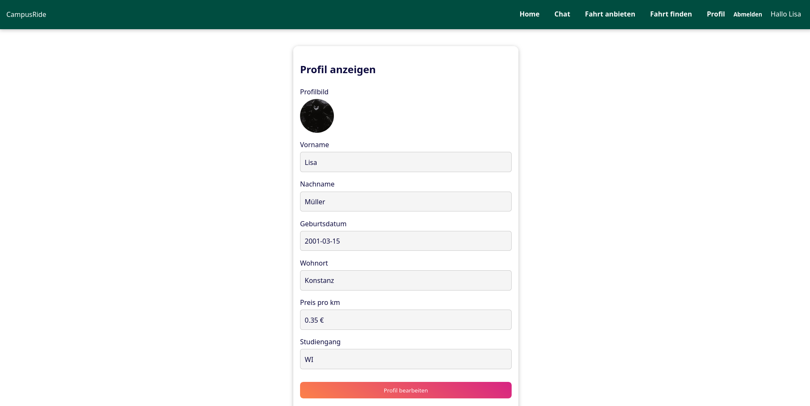
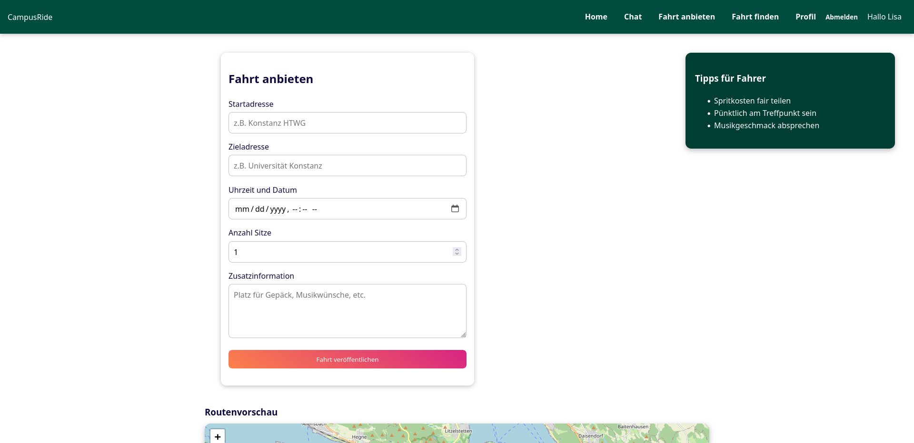
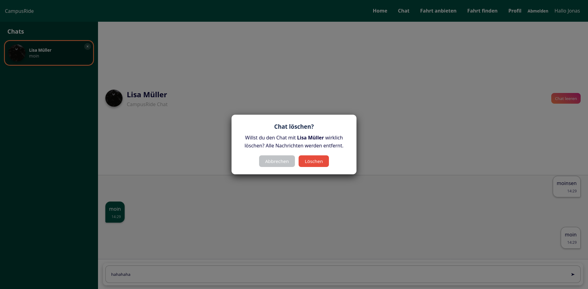
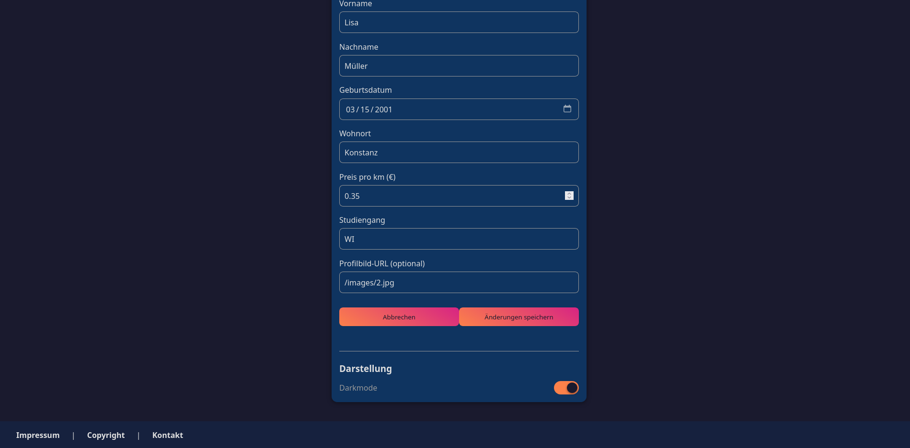
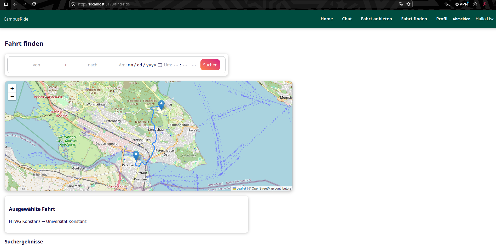

# Webapplikation SS2026 CampusRide

**Autoren:** Marlin Wießenberg, Paul Boos, Robin Dietsche
**Datum:** 24. Juli 2026

---

# 1. Einleitung

CampusRide ist eine Ridesharing-Webapp ausschließlich für Studenten. Sie ermöglicht es, Fahrten anzubieten und zu finden sowie miteinander in Kontakt zu treten, um die genauen Details der Fahrt zu besprechen.

Da wir uns entschieden haben, dass CampusRide (wenn es ein echtes Produkt wäre) ein Non-Profit-Projekt wäre, überlassen wir den Nutzern die vollständige Freiheit über die Preisverhandlungen.

Der Hauptzweck dieser Fahrten ist der regelmäßige Transit von und zum Campus. Andere Fahrten sind jedoch ebenfalls möglich.

CampusRide verfügt über einen In-App-Chat, der die Verbindung zwischen Fahrern und Mitfahrern einfacher und sicherer macht. Dieser ist über den Avatar des Fahrers auf jedes Fahrt-Listing erreichbar.

Bei der Suche und beim Anbieten von Fahrten wird OpenStreetMap integriert, um die Fahrt visuell darzustellen. Diese Routenansicht basiert ausschließlich auf Start- und Endpunkt der Fahrt und ist nicht bindend.

Um zu garantieren, dass nur Studenten die Webapp benutzen, wird bei der Registrierung der E-Mail-Provider mit einer öffentlich verfügbaren Datenbank verglichen.


---

# 2 Technologie-Stack

Aus der Aufgabe:
- HTML, CSS
- TypeScript
- npm
- React
- Prisma

Gewählt:

### Express.js
Gründe für die Auswahl:
- In der Vorlesung behandelt

### Vite
Bundler

Gründe für die Auswahl:
- In der Vorlesung behandelt

### SQLite
Datenbank

Gründe für die Auswahl:
- In der Vorlesung behandelt
- SQL können wir schon
- braucht keinen eigenen Datenbankserver wie PostgreSQL

### OpenStreetMap
OpenStreetMap wird zur Darstellung von Fahrtrouten verwendet, nicht für die Fahrtauswahl

Gründe für die Auswahl:

- kostenlos, anders als die API von Google Maps
- hilfreiche Tools die wir ursprünglich für eine verbesserte Suche gebraucht hätten
- mir ist nichts anderes eingefallen außer OSM und Google Maps

### express-rate-limit

`express-rate-limit` ist installiert, wird aber nicht verwendet (hat mich beim Testen von anderen Sachen aufgeregt)

Es sollte die Anwendung vor Denial-of-Service-Angriffen schützen.


### jsonwebtoken und bcryptjs

JWTs (JSON Web Tokens) werden für die Authentifizierung verwendet. Nach dem Login erhält der Client ein Token mit einer Gültigkeit von zwei Stunden. Für geschützte Anfragen wird dieses Token im `Authorization`-Header als `Bearer`-Token mitgesendet.

bcryptjs übernimmt das Hashing der Passwörter mit einem Salt-Faktor von 10 Runden. Passwörter werden niemals im Klartext gespeichert.

### academic-email-verifier
Gründe für die Auswahl:
- Locale Liste oder Datenbank wäre ungenau und müsste manuell auf Änderungen angepasst werden
- öffentlich und kostenlos

Bei der Registrierung wird die E-Mail-Adresse des Nutzers mit einer öffentlich verfügbaren Datenbank akademischer Domains abgeglichen. Nur Nutzer mit einer gültigen Universitäts-E-Mail-Adresse (z. B. `@uni-konstanz.de`, `@htwg-konstanz.de`) können sich registrieren. Dies stellt sicher, dass CampusRide ausschließlich von Studenten genutzt wird.

### Vitest 
Vitest dient als Testframework für die Backend-Tests.

### Supertest
Testen von Express-Endpunkten

Gründe für die Auswahl:
 - braucht keinen laufenden Server
 - Simuliert HTTP-Anfragen und prüft die Antwort des Backends


---

# 3. Architektur

## 3.1 Datenbankstruktur


### Primär- und Fremdschlüssel

| Tabelle | Primärschlüssel | Fremdschlüssel | Verweist auf |
|---|---|---|---|
| User | `id` | – | – |
| Ride | `id` | `driverId` | User.`id` |
| ChatContact | `id` | `ownerId` | User.`id` |
| ChatContact | `id` | `userId` | User.`id` |
| ChatMessage | `id` | `contactId` | ChatContact.`id` |
| ChatMessage | `id` | `senderId` | User.`id` |

### Besonderheiten
- 2 Variablen zum Speichern jeder Position, da ein Ortsname nicht immer zu der gleichen Position zeigt. Wir speichern also den Namen und die Koordinaten des Punktes
- extra = Fahrt Beschreibung optional
- Type ist ein String für ursprünglich geplante Bildnachrichten
- alle Zeiten sind String

---
### 3.2 Contexts

- **GlobalContext** – `darkMode` toggelt CSS-Klasse `dark` am `<body>` um den Darkmode anzustellen. im `localStorage`
- **UserContext** – Session-Zustand: `currentUser`, `authToken`, `isLoggedIn`, `isAuthLoading`, `profile`. im `localStorage` (`campusRideAuthToken`) und stellt beim App-Start den User über `GET /api/auth/me` wieder her. Bietet `registerUser`, `loginUser`, `logoutUser`, `setProfile`.
- **RideContext** – lädt alle Fahrten einmal beim Mounten und hält sie im Speicher; bietet `addRide`, `removeRide`, `updateRide`, `clearRides`.
- **ChatContext** – Kontakte und Nachrichten; lädt beim Login alle Kontakte inkl. Nachrichten

---
### 3.3 Routing

`src/routes/AppRoutes.tsx` definiert alle Routen. 

| Route | Seite | Geschützt |
|---|---|---|
| `/` | `StartPage` (Login/Registrierung) | nein |
| `/impressum` | `ImpressumPage` | nein |
| `/contact` | `ContactPage` | nein |
| `/copyright` | `CopyrightPage` | nein |
| `/home` | `HomePage` (Übersicht + Karte) | ja |
| `/chat` | `ChatPage` | ja |
| `/create-ride` | `CreateRidePage` | ja |
| `/find-ride` | `FindRidePage` | ja |
| `/profile` | `ProfilePage` | ja |
| `*` | `NotFoundPage` (404) | nein |

`src/routes/ProtectedRoute.tsx` zeigt während der Auth-Prüfung einen Ladeindikator (`isAuthLoading`) und leitet nicht eingeloggte Nutzer per `<Navigate to="/" replace>` zurück zur Startseite.

---
## 3.4 Komponentenstruktur
```text
AppProviders
└── AppRoutes   
    ├── StartPage                               (Login-/Register-Overlays, Formulare)
    ├── ImpressumPage
    ├── ContactPage
    ├── CopyrightPage
    ├── HomePage
    │   ├── Header/ Footer                      (Navigation, Logout, Nutzername)
    │   ├── RouteMapFromCoords                  (Leaflet-Karte + OSRM-Route)
    │   │   └── MapUpdater                      (fitBounds auf Route)
    │   └── RideCard                            (wiederverwendet aus find_ride)
    ├── FindRidePage
    │   ├── Header / Footer
    │   ├── SearchBar                           (von, nach, Datum, Uhrzeit)
    │   ├── RouteMapFromCoords
    │   └── RideCard[]
    ├── CreateRidePage
    │   ├── Header / Footer
    │   ├── Formular                            (Start, Ziel, Datum, Sitze, Extra)
    │   ├── InfoBox
    │   └── RouteMap                            (Geocoding via Nominatim, OSRM-Route)
    │       └── MapUpdater
    ├── ChatPage
    │   ├── Header
    │   ├── ContactItem[]                       (Kontaktliste mit letzter Nachricht)
    │   ├── MessageRow[]                        (Sende-/Empfangsblase)
    │   ├── ChatInput                           (Textfeld + Senden-Button)
    │   └── Bestätigungsdialog                  (Chat löschen)
    ├── ProfilePage
    │   ├── Header / Footer
    │   ├── ProfileField[] / ProfileInput[]     (Anzeige vs. Bearbeiten)
    │   └── Darkmode-Toggle
    └── NotFoundPage
```
---
## 3.5 API-Architektur

Die API von CampusRide ist eine REST-Schnittstelle, über die ausschließlich JSON-Daten ausgetauscht werden.
Sie ist die einzige Verbindung zwischen dem React-Frontend und der SQLite-Datenbank. Dort werden die Anfragen validiert, Berechtigungen geprüft und die Datenbankoperationen über Prisma ausgeführt. Das Backend liefert dabei keine HTML-Seiten, sondern ausschließlich JSON-Antworten.

### Aufbau des Backends

Das Backend liegt unter `react-app/server`. Die zentrale Datei `server/src/app.ts` definiert die Express-Anwendung und alle Endpunkte. Zwei Middlewares gelten für sämtliche Anfragen:

- `cors` erlaubt dem auf Port 5173 laufenden Frontend die Kommunikation mit dem Backend auf Port 3001.
- `express.json()` parst eingehende JSON-Bodies und stellt sie über `req.body` bereit.

Die Route-Handler sind bewusst in einer einzigen Datei gehalten wegen des kleinen Größe des Projekts. Bei weiterem Wachstum wären separate Router-Module sinnvoll. Gestartet wird der Server in `server/src/index.ts`, das vor dem Start die Seed-Funktion ausführt die die Datenbank mit 4 Beispiel Accounts und 1 Fahrt füllt und anschließend auf dem in `PORT` konfigurierten Port lauscht.

### Authentifizierung

Die API unterscheidet öffentliche und geschützte Endpunkte. Öffentliche Endpunkte benötigen keine Anmeldung, geschützte Endpunkte brauchen ein gültiges JWT.

Das JWT wird bei der Registrierung oder Anmeldung im Backend erzeugt, enthält die Benutzer-ID und die E-Mail-Adresse und ist zwei Stunden gültig. Das Frontend sendet es bei jeder geschützten Anfrage im HTTP-Header mit:

```
Authorization: Bearer <token>
```

Die Middleware `authenticateToken` prüft vor der Ausführung eines geschützten Endpunkts, ob der `Authorization`-Header vorhanden und korrekt formatiert ist und ob das Token gültig ist. Falls nicht antwortet das Backend mit `401 Unauthorized`. Bei einem gültigen Token wird die darin enthaltene Benutzer-ID an den Request-Handler übergeben, sodass datenbankseitig zwischen den Benutzern unterschieden werden kann. Auf dieser Grundlage lassen sich Besitzprüfungen umsetzen: Beispielsweise darf nur der Fahrer einer Fahrt diese über `PUT` ändern oder über `DELETE` löschen; für fremde Fahrten antwortet das Backend mit `403 Forbidden`.

### Endpunkte im Überblick

| Methode | Pfad | Zweck | Schutz |
|---|---|---|---|
| GET | `/api/health` | Gesundheitscheck | öffentlich |
| GET | `/api/db-status` | DB-Status und User-Anzahl | öffentlich |
| POST | `/api/auth/register` | Registrierung | öffentlich |
| POST | `/api/auth/login` | Login | öffentlich |
| GET | `/api/auth/me` | Aktuellen User abrufen | geschützt |
| PUT | `/api/auth/me` | Profil aktualisieren | geschützt |
| GET | `/api/rides` | Alle Fahrten abrufen | öffentlich |
| POST | `/api/rides` | Fahrt erstellen (Fahrer aus dem JWT) | geschützt |
| PUT | `/api/rides/:id` | Fahrt aktualisieren | geschützt |
| DELETE | `/api/rides/:id` | Fahrt löschen | geschützt |
| GET | `/api/chat/contacts` | Chat-Kontakte abrufen | geschützt |
| POST | `/api/chat/contacts` | Chat-Kontakt erstellen | geschützt |
| POST | `/api/chat/messages` | Nachricht senden | geschützt |
| DELETE | `/api/chat/messages/:contactId` | Chat leeren | geschützt |
| DELETE | `/api/chat/contacts/:contactId` | Kontakt löschen | geschützt |

### Fehlerbehandlung

Jeder Endpunkt validiert seine Eingaben und antwortet mit semantisch passenden HTTP-Statuscodes. Fehlende oder leere Pflichtfelder führen zu `400 Bad Request`, doppelte E-Mail-Adressen oder Benutzernamen zu `409 Conflict`, falsche Anmeldedaten zu `401 Unauthorized` und nicht vorhandene Ressourcen zu `404 Not Found`. Fehler folgen dabei dem Schema `{ "error": "..." }`, das das Frontend über `readErrorMessage` auswertet und dem Nutzer anzeigt.

Die öffentlichen Repräsentationen `publicUser` und `publicRide` mappen die internen Datenbankobjekte auf eigene Antwortformate. Dadurch werden sensible Felder wie der `passwordHash` niemals an das Frontend übertragen und komplexe Strukturen wie die Fahrtenkoordinaten übersichtlich als `departureCoords` bzw. `destinationCoords` mit `lat` und `lng` geliefert.

### API-Schicht im Frontend

Das Frontend kapselt sämtliche `fetch`-Aufrufe in der API-Schicht `src/api/`. Komponenten und Contexts rufen nie direkt `fetch` auf, sondern Funktionen aus dieser Schicht:

| Datei | Inhalt |
|---|---|
| `apiUtils.ts` | Basis-URL `API_BASE_URL` und Fehlerauswertung `readErrorMessage` |
| `authApi.ts` | Registrierung, Login, Benutzer laden und Profil aktualisieren |
| `rideApi.ts` | Fahrten laden, erstellen, aktualisieren und löschen |
| `chatApi.ts` | Chatkontakte und Nachrichten verwalten |

Jede Funktion baut die URL aus `API_BASE_URL` und dem Pfad zusammen, setzt die Header `Content-Type: application/json` und bei geschützten Aufrufen `Authorization: Bearer <token>`, prüft `response.ok` und wirft bei Fehlern eine `Error` mit der Servermeldung. Der Datenfluss bei einer geschützten Anfrage folgt damit:

```
Komponente → Context → api/ → fetch → Express → Prisma → SQLite → Antwort zurück
```

### Sequenzdiagramm für einen geschützten Request

Das folgende Sequenzdiagramm zeigt den Ablauf einer geschützten Anfrage am Beispiel des erfolgreichen Erstellens einer Fahrt über `POST /api/rides`:



### Externe APIs


Ergänzend werden noch fremde APIs benutzt: Nominatim geokodiert Ortsnamen zu Koordinaten, OSRM berechnet daraus die Fahrtrouten und die OpenStreetMap-Tiles liefern die Kartenbilder für Leaflet. Diese Anfragen laufen nicht über unser Backend.


# 4. Umsetzung

## Meilenstein 1 – Projektstart und Fundament

Der erste Meilenstein hatte das Ziel, die Grundidee von CampusRide als statischen HTML- und CSS-Prototyp umzusetzen. Zu diesem Zeitpunkt gab es noch kein React-Frontend, kein Backend und keine Datenbank. Im Vordergrund standen deshalb die Struktur der Anwendung, die wichtigsten Ansichten, eine konsistente Gestaltung und eine nachvollziehbare Navigation. Der damalige Stand ist im Git-Tag **Meilenstein_1** festgehalten.

### Aufbau des statischen Prototyps

Die Anwendung bestand aus mehreren HTML-Seiten, die bereits die späteren Kernbereiche von CampusRide abbildeten. Die zentrale Einstiegsseite befand sich in `html/index.html`. Daneben gab es unter anderem eigene Seiten für die Fahrtübersicht (`html/home/home.html`), die Fahrtensuche (`html/find_ride/find_ride.html`), das Anbieten einer Fahrt (`html/create_ride/create_ride.html`), den Chat (`html/chat/chat.html`), das Profil (`html/profile/profile.html`) und das Impressum (`html/impressum/impressum.html`).

Damit war schon im ersten Meilenstein die grundlegende Informationsarchitektur der Anwendung erkennbar. Nutzer sollten sich auf der Startseite anmelden oder registrieren und anschließend zwischen Home, Chat, Fahrt anbieten, Fahrt finden und Profil wechseln können. Die Inhalte waren zu diesem Zeitpunkt noch statisch. Beispielsweise zeigte die Startseite nach der Anmeldung eine fest eingetragene Fahrt von Bremen nach Hannover mit einer Beispielkarte und einem Beispielprofil. Auch die Chatnachrichten und Profildaten waren reine Platzhalter.

### Semantisches HTML

Ein Schwerpunkt des Meilensteins war die Verwendung semantischer HTML-Elemente. In `html/index.html` wurden die Bereiche der Seite mit `header`, `nav`, `main`, `article`, `section` und `footer` gegliedert. Dadurch wurde nicht nur das Aussehen, sondern auch die Bedeutung der einzelnen Bereiche im Quellcode sichtbar. Die Fahrt auf der Home-Seite wurde beispielsweise innerhalb eines `article`-Elements dargestellt, da sie als eigenständiger Inhalt betrachtet werden kann.

Weitere semantische Elemente wurden auf den Unterseiten eingesetzt. In `html/create_ride/create_ride.html` enthält der Hauptbereich neben dem Formular ein `aside` mit Hinweisen für Fahrer. Das Impressum verwendet mehrere `section`-Elemente sowie `address` für die Adressangaben. Diese Struktur verbesserte die Lesbarkeit des Codes und schuf zugleich eine geeignete Grundlage für Barrierefreiheit und spätere Weiterentwicklung.

### Formulare und vorbereitete Nutzeraktionen

Bereits in M1 wurden mehrere Formulare entworfen. Die Startseite enthielt jeweils ein Formular für Login und Registrierung. Weitere Formulare wurden für die Fahrtensuche, das Erstellen einer Fahrt und das Schreiben einer Chatnachricht vorbereitet. Die Eingabefelder waren über `label`-Elemente mit den jeweiligen Feldern verknüpft. Zusätzlich wurden `name`-Attribute verwendet, sodass die Formulardaten später grundsätzlich verarbeitet werden konnten. Pflichtfelder waren mit `required` gekennzeichnet und teilweise durch passende Typen wie `date`, `time`, `datetime-local`, `number` oder `password` eingeschränkt.

Eine echte Verarbeitung der Eingaben war in diesem Meilenstein noch nicht vorgesehen. Die Formulare für Login, Registrierung und das Anbieten einer Fahrt verwiesen nach dem Absenden lediglich auf eine andere statische HTML-Seite. Die Login- und Registrierungsfenster wurden ohne JavaScript über versteckte Checkboxen und CSS-Selektoren umgesetzt. In `html/popup.css` öffnet die Regel für `:checked` das jeweilige Overlay. Dadurch konnte bereits eine einfache sichtbare Interaktion demonstriert werden, obwohl laut Aufgabenstellung noch kein JavaScript erforderlich war.

### Gestaltung und responsives Layout

Die grundlegende Gestaltung wurde in `html/style.css` zentralisiert. Farben, Schatten und Farbverläufe wurden als CSS-Variablen im `:root`-Bereich definiert. Auf diese Weise konnten dieselben Markenfarben in unterschiedlichen Ansichten wiederverwendet werden. Der `body` wurde als vertikaler Flex-Container mit einer Mindesthöhe von `100vh` umgesetzt. Der Hauptbereich füllte dadurch den Platz zwischen Header und Footer aus. Auch der Header nutzte Flexbox, um Logo und Navigation horizontal anzuordnen.

Zusätzlich existierten seitenspezifische Stylesheets. `html/home/rout_recomendation.css` definierte das Karten- und Fahrtenlayout, `html/find_ride/searchbar.css` die Suchleiste und `html/create_ride/create_ride.css` das Formular samt Informationsbox. Der Chat wurde in `html/chat/chatstyle.css` mit CSS Grid aufgebaut. Dabei wurden feste Bereiche für Header, Kontaktliste, Nachrichtenbereich und Eingabezeile definiert. Somit kamen sowohl Flexbox als auch Grid in sinnvollen Anwendungsfällen zum Einsatz.

Für kleinere Bildschirme enthielt `html/style.css` eine Media Query bei maximal 600 Pixel Breite. Der Header wechselte dort von einer horizontalen zu einer vertikalen Anordnung. Weitere Layouts nutzten `flex-wrap` oder flexible Breiten, damit Inhalte bei geringerem Platz umbrechen konnten. Damit erfüllte der Prototyp bereits die grundlegenden Anforderungen an ein responsives Layout.

### URL-Struktur und Navigation

Die Navigation erfolgte in M1 über relative Dateipfade. Von der Startseite führte das Absenden des Loginformulars beispielsweise zu `home/home.html`. Von dort waren die übrigen Ansichten über Links wie `../chat/chat.html`, `../create_ride/create_ride.html` oder `../profile/profile.html` erreichbar. Diese Struktur war noch dokumentenbasiert, bildete aber bereits die späteren fachlichen Routen der Anwendung ab.

### Weiterentwicklung im finalen Projektstand

Die in M1 entwickelten Seiten wurden in den späteren Meilensteinen nicht verworfen, sondern schrittweise in React- und TypeScript-Dateien überführt. Die Startseite befindet sich jetzt in `react-app/src/StartPage.tsx`. Die übrigen Ansichten liegen unter `react-app/src/pages/`, beispielsweise in `home/home.tsx`, `find_ride/find_ride.tsx` und `create_ride/create_ride.tsx`. Die semantische Grundstruktur aus M1 ist dabei weiterhin erkennbar. In JSX werden lediglich angepasste Attributnamen wie `className` statt `class` und `htmlFor` statt `for` verwendet.

Wiederkehrende Bereiche wurden später als eigene React-Komponenten in `components/Header.tsx` und `components/Footer.tsx` ausgelagert. Die relative Navigation zwischen einzelnen HTML-Dateien wurde durch React Router und sprechende Pfade wie `/home`, `/chat`, `/create-ride` und `/find-ride` ersetzt. Diese Weiterentwicklungen gehören inhaltlich zu den späteren Meilensteinen. M1 lieferte dafür jedoch das visuelle und strukturelle Fundament: die wichtigsten Seiten, die Formulare, das responsive Layout und die grundlegende Benutzerführung von CampusRide.

---

## Meilenstein 2 – React-Umbau und Interaktion

Im zweiten Meilenstein wurde der statische HTML- und CSS-Prototyp aus M1 in eine interaktive React-Anwendung überführt. Ziel war es, die vorhandenen Seiten nicht nur optisch nachzubilden, sondern sie in wiederverwendbare Komponenten zu zerlegen, Daten mit TypeScript zu typisieren und sichtbare Nutzerinteraktionen mithilfe von React Hooks umzusetzen. Der damalige Stand ist im Git-Tag **Meilenstein_2** dokumentiert. Benötigte Daten werden noch im Browser verwaltet, da noch keine Datenbank im Backend vorhanden ist.

### Tooling und Einstieg in React

Für den Umbau wurde im Ordner `react-app` ein React-Projekt mit npm, Vite und TypeScript eingerichtet. Die benötigten Befehle wurden in `package.json` als Skripte hinterlegt. Mit `npm run dev` konnte die Anwendung über den Vite-Entwicklungsserver gestartet werden, während `npm run build` zunächst die TypeScript-Prüfung und anschließend den Produktions-Build ausführte.

Der Einstiegspunkt der Anwendung befindet sich in `src/main.tsx`. Dort wird die React-Anwendung mit `createRoot` in das Root-Element der HTML-Datei eingebunden. Zusätzlich werden die übergeordneten Context-Provider und der `BrowserRouter` um die eigentliche Anwendung gelegt. Dadurch standen gemeinsam genutzte Zustände und die Navigation in allen darunterliegenden Seiten zur Verfügung. Die statischen HTML-Dateien aus M1 wurden damit weitgehend durch TSX-Dateien ersetzt, während die vorhandenen CSS-Dateien weiterverwendet wurden.

### TypeScript und Datenmodelle

TypeScript wurde nicht nur für die Dateiendungen verwendet, sondern insbesondere zur Modellierung der Anwendungsdaten. In `src/contexts/ridecontext.tsx` beschreibt das Interface `Ride` eine Fahrt mit Start- und Zielort, Koordinaten, Entfernung, Fahrtdauer, Fahrer, Abfahrtszeit, freien Sitzplätzen und Preis. Der Typ `NewRide` wird mit `Omit<Ride, "id">` aus diesem Modell abgeleitet, da die ID erst beim Speichern erzeugt wird.

Weitere Datenmodelle wurden für Benutzerprofile und Chats definiert. `UserProfile`, `RegisteredUser`, `RegisterUserInput` und `LoginUserInput` legen in `usercontext.tsx` die Struktur von Nutzerdaten fest. In `chatcontext.tsx` werden Kontakte und Nachrichten durch `ChatContact` und `ChatMessage` beschrieben. Auch Komponenten-Props und Ereignisse sind typisiert. So erwartet `RideCard` über `RideCardProps` eine Fahrt sowie optional eine Auswahlfunktion, während die Profilseite für ihre Eingabekomponente den Feldnamen auf `keyof UserProfile` begrenzt. Dadurch konnten ungültige Datenübergaben bereits während der Entwicklung erkannt werden.

### Komponenten und Props

Die Seiten wurden in kleinere Komponenten mit klaren Aufgaben zerlegt. Ein wichtiges Beispiel ist `src/pages/find_ride/rideCard.tsx`. Die Komponente `RideCard` erhält eine Fahrt über Props und stellt daraus Fahrer, Strecke, Zeitpunkt, freie Plätze, Preis und Zusatzinformationen dar. Über die optionale Prop `onSelect` kann die übergeordnete Seite festlegen, was beim Anklicken einer Fahrt geschieht. Dieselbe Komponente wird sowohl auf der Home-Seite als auch in der Fahrtensuche verwendet.

Auch die Chatansicht zeigt die Zerlegung in wiederverwendbare Teile. In `src/pages/chat/chat.tsx` stellt `ContactItem` einen Kontakt in der Seitenleiste dar, `MessageRow` rendert eine einzelne gesendete oder empfangene Nachricht und `ChatInput` kapselt das Eingabefeld samt Sendevorgang. Die benötigten Daten und Callback-Funktionen werden jeweils über typisierte Props übergeben. Auf der Profilseite wurden mit `ProfileField` und `ProfileInput` getrennte Komponenten für die Anzeige und Bearbeitung eines Profilwerts umgesetzt.

### Lokaler Zustand und kontrollierte Formulare

React Hooks machten die zuvor statischen Seiten interaktiv. Besonders deutlich ist dies in `src/pages/create_ride/create_ride.tsx`. Die Eingaben für Start, Ziel, Zeitpunkt, Sitzplätze und Zusatzinformationen werden gemeinsam in einem mit `useState` verwalteten Formularobjekt gespeichert. Da die Werte der Eingabefelder aus diesem Zustand stammen und jede Änderung über `onChange` zurückgeschrieben wird, handelt es sich um kontrollierte Formularelemente. Zusätzliche Zustände steuern die Erfolgsmeldung und den Text des Speicherbuttons.

Beim Absenden werden die Eingaben in ein typisiertes `NewRide`-Objekt umgewandelt. Start- und Zielkoordinaten werden ermittelt und daraus eine ungefähre Entfernung, Dauer und ein Preis berechnet. Anschließend fügt `addRide` die neue Fahrt dem gemeinsamen Fahrtenzustand hinzu. Die Fahrt erscheint dadurch unmittelbar auf der Home-Seite und in der Fahrtensuche. Nach einer kurzen Erfolgsmeldung wird zur Home-Seite navigiert. Diese Abfolge bildet die zentrale durchgängige Nutzeraktion von M2: Formular ausfüllen, Fahrt veröffentlichen und das Ergebnis ohne Neuladen auf anderen Ansichten sehen.

Weitere lokale Zustände werden für die ausgewählte Fahrt, die Suchkriterien, die Chat-Eingabe und den Bearbeitungsmodus des Profils eingesetzt. In `find_ride.tsx` übergibt die `SearchBar` die eingegebenen Kriterien an die übergeordnete Seite. Dort werden die vorhandenen Fahrten nach Start, Ziel, Datum und Uhrzeit gefiltert. Das Anklicken einer `RideCard` setzt die ausgewählte Fahrt und aktualisiert gleichzeitig die Routendarstellung.

### Effekte und vorläufige Persistenz

`useEffect` wurde dort eingesetzt, wo eine Änderung des React-Zustands eine Nebenwirkung auslösen sollte. Die Context-Dateien speichern Fahrten, Benutzer und Chatnachrichten im `localStorage`, sobald sich die jeweiligen Daten verändern. Beim Start der Anwendung werden diese Werte wieder eingelesen. Dadurch blieben neu erstellte Fahrten, registrierte Nutzer, Profiländerungen und Nachrichten auch nach einem Neuladen des Browsers erhalten.

Diese Speicherung war eine Übergangslösung für M2 und nicht als sichere Produktivlösung gedacht. Insbesondere die lokale Benutzerverwaltung ersetzte noch keine echte Authentifizierung. Im folgenden Meilenstein wurden diese Aufgaben deshalb auf das Express-Backend und die Datenbank verlagert.

Zusätzlich wurden Effekte für die Kartenansicht verwendet. `RouteMap.tsx` reagiert auf Änderungen der eingegebenen Orte, fragt Koordinaten und Routendaten ab und aktualisiert anschließend Marker und Streckenlinie. Der eigene Hook `useDebounce` verzögert die Anfrage, damit nicht nach jedem einzelnen Tastendruck sofort ein neuer Request ausgelöst wird. Weitere Effekte passen den sichtbaren Kartenausschnitt an oder scrollen den Chat nach einer neuen Nachricht automatisch nach unten.

### Ergebnis und Weiterentwicklung bis zum finalen Projektstand

Mit M2 wurde aus dem statischen Prototyp eine bedienbare Single-Page-Anwendung. Die damals entwickelten TSX-Seiten, kontrollierten Formulare, Props und Hooks bilden auch im finalen Projekt weiterhin die Grundlage des Frontends. Die größten Änderungen betreffen deshalb weniger die sichtbare Bedienung als die Aufteilung des Codes und die Herkunft der Daten.

In M2 befanden sich die Routendefinitionen noch gemeinsam mit der Startseite in `src/StartPage.tsx`. Im finalen Stand enthält diese Datei nur noch die Login- und Registrierungsoberfläche. Die Navigation wurde nach `src/routes/AppRoutes.tsx` ausgelagert und dort um geschützte Routen, Weiterleitungen und eine 404-Seite ergänzt. Wiederkehrende Bereiche, die in M2 in mehreren Seiten einzeln definiert waren, wurden außerdem in `src/components/Header.tsx` und `src/components/Footer.tsx` zusammengefasst. Fachliche Komponenten wie `RideCard`, `ContactItem`, `MessageRow`, `ChatInput`, `ProfileField` und `ProfileInput` blieben dagegen in ihrer grundsätzlichen Funktion erhalten.

Deutlich verändert wurden die Context-Dateien. In M2 speicherten `UserContext`, `RideContext` und `ChatContext` ihre Daten überwiegend im `localStorage`. Im finalen Projekt verwalten sie weiterhin den gemeinsamen React-State, greifen für Benutzer, Fahrten und Chats jedoch über `authApi.ts`, `rideApi.ts` und `chatApi.ts` auf das Express-Backend und die SQLite-Datenbank zu. Der `UserContext` verwaltet zusätzlich das JWT; lokal gespeichert bleiben nur clientseitige Werte wie das Token, der ausgewählte Chatkontakt und der Darkmode.

Die TypeScript-Modelle wurden entsprechend erweitert: Fahrten besitzen nun eine `driverId`, Chatnachrichten eine `senderId`, und Benutzerprofile enthalten unter anderem ein Profilbild und einen numerischen Kilometerpreis. Damit konnte die in M2 entwickelte Interaktionsstruktur weiterverwendet werden, obwohl die Daten im finalen Stand nicht mehr nur im Browser, sondern persistent im Backend gespeichert werden.

---

## Meilenstein 3 – Daten, Routing, REST, Qualität und Backend

Im dritten Meilenstein wurde die bis dahin ausschließlich im Browser laufende React-Anwendung zu einer Full-Stack-Anwendung erweitert. Der Schwerpunkt lag auf einer klaren URL-Struktur mit React Router, der Kommunikation mit einem eigenen REST-Backend, einer persistenten Datenhaltung sowie einer echten Registrierung und Anmeldung. Zusätzlich wurden sichtbare Lade- und Fehlerzustände sowie automatisierte Tests ergänzt. Der damalige Stand ist im Git-Tag **Meilenstein_3** dokumentiert.

### Routing und geschützte Seiten

Die Navigation wurde mit React Router zentral organisiert. In `src/main.tsx` wird die Anwendung innerhalb eines `BrowserRouter` gerendert. Die eigentlichen Routendefinitionen befinden sich in `src/routes/AppRoutes.tsx`. Dort werden unter anderem die Pfade `/`, `/home`, `/chat`, `/create-ride`, `/find-ride`, `/profile` und `/impressum` den jeweiligen React-Seiten zugeordnet. Für unbekannte URLs existiert außerdem eine eigene 404-Seite. Zusätzliche Weiterleitungen von älteren Pfaden wie `/create_ride` und `/find_ride` verhindern, dass bereits verwendete Links ungültig werden.

Die Navigation erfolgt innerhalb der Anwendung über `Link`, `Navigate` und `useNavigate`. Dadurch wird beim Wechsel zwischen den Ansichten nicht das gesamte HTML-Dokument neu geladen. Nach einer erfolgreichen Anmeldung oder Registrierung navigiert die Startseite beispielsweise direkt zur Home-Seite.

Die Seiten mit nutzerspezifischen Inhalten wurden durch die Komponente `ProtectedRoute` geschützt. Sie prüft über den `UserContext`, ob ein Benutzer angemeldet ist. Solange ein vorhandenes Token überprüft wird, erscheint der sichtbare Ladehinweis „Authentifizierung wird geprüft...“. Ist keine gültige Anmeldung vorhanden, leitet `Navigate` zurück zur Startseite. Auf diese Weise sind die Routen für Home, Chat, Fahrt anbieten, Fahrt finden und Profil nicht ohne Anmeldung erreichbar.

### Eigenes Express-Backend und REST-Schnittstelle

Für M3 wurde im Ordner `react-app/server` ein eigenes Node.js-Backend mit Express eingerichtet. `src/index.ts` startet den Server auf Port 3001, während `src/app.ts` die Express-Anwendung und ihre Endpunkte enthält. Die Middleware `express.json()` verarbeitet JSON-Anfragen. CORS erlaubt dem auf Port 5173 laufenden Vite-Frontend, Anfragen an das Backend zu senden.

Die Kommunikation zwischen Frontend und Backend wurde in `src/api/authApi.ts` gekapselt. Die Funktionen `registerUserRequest`, `loginUserRequest` und `getCurrentUserRequest` verwenden `fetch` gegen die Basisadresse `http://localhost:3001/api`. Registrierung und Login senden JSON-Daten mit `POST`, während der aktuell angemeldete Benutzer über einen `GET`-Request geladen wird.

Im M3-Stand standen folgende zentrale Endpunkte zur Verfügung:

| Methode | Endpunkt | Aufgabe |
|---|---|---|
| `GET` | `/api/health` | Prüft, ob das Backend erreichbar ist |
| `GET` | `/api/db-status` | Prüft die Datenbankverbindung und liefert die Benutzeranzahl |
| `POST` | `/api/auth/register` | Registriert einen Benutzer |
| `POST` | `/api/auth/login` | Meldet einen Benutzer an |
| `GET` | `/api/auth/me` | Liefert den Benutzer zum übergebenen JWT |

Damit waren sowohl lesende als auch schreibende REST-Anfragen umgesetzt. Die API antwortet mit passenden HTTP-Statuscodes. Fehlende Eingaben führen beispielsweise zu `400 Bad Request`, doppelte E-Mail-Adressen oder Benutzernamen zu `409 Conflict` und fehlerhafte Anmeldedaten zu `401 Unauthorized`.

### Datenbankzugriff mit Prisma und SQLite

Die persistente Datenhaltung wurde mit SQLite und Prisma umgesetzt. Das Prisma-Schema unter `server/prisma/schema.prisma` enthielt in M3 zunächst das Modell `User`. Gespeichert wurden eine eindeutige E-Mail-Adresse und ein eindeutiger Benutzername, der Passwort-Hash, Vor- und Nachname, Geburtsdatum, Studiengang sowie Zeitstempel für Erstellung und Änderung.

Beim Registrieren prüft das Backend zunächst die Pflichtfelder und normalisiert E-Mail-Adresse und Benutzername. Anschließend wird mit Prisma kontrolliert, ob bereits ein Benutzer mit denselben Zugangsdaten existiert. Ist dies nicht der Fall, wird der neue Datensatz mit `prisma.user.create()` in SQLite gespeichert. Die Datenbank wird über eine Prisma-Migration erzeugt und nicht durch eine statische JSON-Datei simuliert.

Persistiert wurden zu diesem Zeitpunkt vor allem die Benutzerkonten. Fahrten und Chatnachrichten wurden im M3-Tag weiterhin über ihre React-Contexts im `localStorage` des Browsers gespeichert. Diese Aufteilung war ausreichend, um die Datenbankanbindung und echte Accounts umzusetzen, wurde für die finale Version jedoch noch erweitert.

### Authentifizierung mit bcrypt und JWT

Passwörter werden nicht im Klartext gespeichert. Bei der Registrierung erzeugt `bcrypt.hash()` mit einem Kostenfaktor von 10 einen Passwort-Hash. Beim Login wird das eingegebene Passwort mit `bcrypt.compare()` gegen diesen Hash geprüft. Die API gibt in ihren Benutzerobjekten nur öffentliche Profildaten zurück; der Passwort-Hash wird nicht an das Frontend übertragen.

Nach einer erfolgreichen Registrierung oder Anmeldung erzeugt das Backend mit `jsonwebtoken` ein JWT mit einer Gültigkeit von zwei Stunden. Das Token enthält die Benutzer-ID und die E-Mail-Adresse. Im Frontend verwaltet der `UserContext` das Token und den aktuell angemeldeten Benutzer. Das Token wird im `localStorage` abgelegt, damit die Anmeldung nach einem Neuladen wiederhergestellt werden kann.

Für geschützte Anfragen wird das JWT im Header als `Authorization: Bearer <Token>` übertragen. Die Middleware `authenticateToken` kontrolliert, ob der Header vorhanden und korrekt formatiert ist und ob das Token gültig ist. Erst danach wird der geschützte Endpunkt `/api/auth/me` ausgeführt. Beim Start der Anwendung ruft der `UserContext` diesen Endpunkt auf. Ist das gespeicherte Token ungültig oder abgelaufen, werden Token und Benutzerzustand entfernt.

### Geteilter Zustand sowie Lade- und Fehlerbehandlung

Die bereits in M2 eingeführten Contexts wurden für M3 weiterverwendet. `AppProviders.tsx` stellt unter anderem den `UserContext`, `RideContext` und `ChatContext` für die gesamte Anwendung bereit. Besonders der `UserContext` übernimmt nun nicht mehr nur eine lokale Benutzerverwaltung, sondern verbindet die React-Oberfläche mit der Authentifizierungs-API.

Registrierung und Anmeldung liefern ein typisiertes `AuthResult` zurück. Dadurch kann die Startseite Fehler direkt beim jeweiligen Formular anzeigen. Fehlermeldungen aus dem Backend werden in `authApi.ts` aus der JSON-Antwort gelesen und als JavaScript-Fehler weitergegeben. Auch Netzwerkfehler oder nicht erfolgreiche HTTP-Antworten führen somit nicht zu einem stillen Scheitern. Parallel verhindert der Zustand `isAuthLoading`, dass eine geschützte Seite angezeigt oder vorschnell umgeleitet wird, während das gespeicherte Token noch überprüft wird.

### Automatisierte API-Tests

Die zentralen Backend-Funktionen wurden mit Vitest und Supertest getestet. Supertest kann Requests direkt gegen die exportierte Express-Anwendung ausführen, ohne dass dafür manuell ein Serverprozess gestartet werden muss. Im M3-Stand bestanden vier API-Tests.

Ein Test prüft den Health-Endpunkt. Ein weiterer stellt sicher, dass `/api/auth/me` ohne JWT mit Status 401 abgewiesen wird. Der umfangreichste Test registriert einen neuen Benutzer, meldet ihn anschließend an und ruft mit dem erhaltenen Token den geschützten Benutzerendpunkt auf. Dabei wird auch geprüft, dass keine Passwortdaten in der Antwort enthalten sind. Der vierte Test kontrolliert, dass ein falsches Passwort abgelehnt wird. Eindeutige E-Mail-Adressen und Benutzernamen werden mit einem Zeitstempel erzeugt, damit sich wiederholte Testläufe nicht gegenseitig blockieren.

### Architekturentscheidung

Die in der README dokumentierte Architektur bestand aus drei Ebenen: der React-SPA im Browser, dem Express-Backend als HTTP-API und der über Prisma angebundenen SQLite-Datenbank. Diese Trennung verhindert, dass das Frontend direkt auf die Datenbank zugreift. Stattdessen laufen Validierung, Passwort-Hashing, Token-Erzeugung und Datenbankoperationen kontrolliert im Backend.

Server-Side Rendering oder Static Site Generation waren für CampusRide nicht erforderlich. Die Anwendung besteht hauptsächlich aus Login, Formularen, Kartenansichten und nutzerspezifischen Daten. Sie ist daher stark interaktiv und nicht primär auf öffentlich indexierbare Inhaltsseiten oder Suchmaschinenoptimierung ausgerichtet.

### Weiterentwicklung bis zum finalen Projektstand

Die in M3 eingeführte Grundarchitektur wurde im finalen Projekt beibehalten. React Router, `ProtectedRoute`, der `UserContext`, das Express-Backend, Prisma, SQLite, bcrypt und JWT arbeiten weiterhin nach demselben Prinzip. Die wesentliche Weiterentwicklung bestand darin, die Persistenz auf die übrigen Kernfunktionen auszudehnen.

Das Prisma-Schema enthält im finalen Stand zusätzlich die Modelle `Ride`, `ChatContact` und `ChatMessage` sowie Relationen zu den Benutzern. Fahrten werden über eigene GET-, POST-, PUT- und DELETE-Endpunkte verwaltet. Auch Chatkontakte und Nachrichten werden über geschützte API-Endpunkte geladen, erstellt und gelöscht. Entsprechend greifen `ridecontext.tsx` und `chatcontext.tsx` nicht mehr hauptsächlich auf den `localStorage`, sondern über `rideApi.ts` und `chatApi.ts` auf das Backend zu.

Das Benutzerprofil wurde um Stadt, Kilometerpreis und Profilbild erweitert und kann über `PUT /api/auth/me` persistent geändert werden. Zusätzlich prüft die finale Registrierung mithilfe von `academic-email-verifier`, ob eine akademische E-Mail-Adresse verwendet wird. Die Tests wurden auf Registrierungsvalidierung, Profilbilder, Fahrten, Berechtigungsprüfungen, Chats und Datenbankstatus ausgeweitet. M3 bildete damit das technische Fundament; die finale Version übertrug dieselbe REST- und Datenbankarchitektur auf sämtliche wesentlichen Anwendungsdaten.

---

## Meilenstein 4 – Betrieb, Fertigstellung und Abschluss

Der vierte Meilenstein hatte das Ziel, den in M3 aufgebauten Full-Stack-Prototypen zu einer reproduzierbar startbaren und durchgängig nutzbaren Anwendung fertigzustellen. Im Mittelpunkt standen deshalb nicht mehr einzelne neue Vorlesungskonzepte, sondern der zuverlässige Betrieb der Gesamtanwendung, die Vervollständigung der persistenten Kernfunktionen und eine konkrete Performance-Maßnahme.

### Vervollständigung der Full-Stack-Anwendung

Im M3-Stand waren bereits das Express-Backend, die SQLite-Datenbank und die Authentifizierung vorhanden. Persistiert wurden zu diesem Zeitpunkt jedoch hauptsächlich die Benutzerkonten. Für den finalen Stand wurde das Prisma-Datenmodell in `react-app/server/prisma/schema.prisma` deshalb um die Modelle `Ride`, `ChatContact` und `ChatMessage` erweitert. Zusätzlich erhielt das Modell `User` die Profilfelder `city`, `pricePerKm` und `avatarUrl`.

Damit werden nun nicht nur Benutzer, sondern auch angebotene Fahrten, Chatkontakte, Nachrichten und Profiländerungen dauerhaft in SQLite gespeichert. Die zuvor teilweise auf `localStorage` basierenden Contexts wurden auf API-Zugriffe umgestellt. `ridecontext.tsx` verwendet die Funktionen aus `src/api/rideApi.ts`, während `chatcontext.tsx` über `src/api/chatApi.ts` auf das Backend zugreift. Der lokale React-State dient damit vor allem zur Darstellung und Aktualisierung der Oberfläche; die dauerhafte Datenquelle ist die Datenbank.

Das Backend stellt für Fahrten Endpunkte zum Laden, Erstellen, Ändern und Löschen bereit. Änderungen und Löschungen sind nur für den jeweiligen Fahrer erlaubt. Für den Chat existieren Endpunkte zum Laden und Anlegen von Kontakten, zum Senden von Nachrichten sowie zum Leeren oder Entfernen eines Chats. Beim Klick auf das Profilbild eines Fahrers kann ein passender Chatkontakt erzeugt werden. Dadurch sind die zentralen Nutzungsschritte – Registrierung, Login, Fahrt anbieten, Fahrt finden und Kontaktaufnahme – im finalen Stand durchgängig miteinander verbunden.

Auch die Registrierung wurde weiter abgesichert. Mithilfe von `academic-email-verifier` prüft das Backend, ob eine akademische E-Mail-Adresse verwendet wird. Neue Benutzer erhalten außerdem eines der vorhandenen Standard-Profilbilder, falls kein eigenes Bild gewählt wurde. Profilangaben wie Name, Studiengang, Wohnort, Kilometerpreis und Profilbild können über den geschützten Endpunkt `PUT /api/auth/me` persistent geändert werden.

### Reproduzierbarer Betrieb mit Docker Compose

Die wichtigste betriebliche Erweiterung von M4 ist die Containerisierung der Anwendung. Im Projekt-Root befindet sich die Datei `docker-compose.yml`, die Frontend und Backend gemeinsam startet. Dadurch ist keine getrennte manuelle Installation und Konfiguration beider Anwendungsteile erforderlich.

Docker Compose definiert zwei Services:

| Service | Aufgabe | Port |
|---|---|---|
| `client` | React-Frontend mit Vite | `5173` |
| `server` | Express-Backend, Prisma und SQLite | `3001` |

SQLite benötigt keinen eigenen Datenbankserver und daher auch keinen separaten Datenbank-Container. Die Datenbankdatei befindet sich im Backend-Container unter `/app/data/dev.db`. Das benannte Docker-Volume `db-data` wird an dieses Verzeichnis gebunden. Dadurch bleiben Benutzer, Fahrten und Chats auch dann erhalten, wenn die Container beendet oder neu erstellt werden. Erst ein bewusstes Entfernen des Volumes würde die persistierten Daten löschen.

Für beide Services existiert ein eigenes Dockerfile. Das Frontend-Dockerfile verwendet ein Node-20-Image, installiert die npm-Abhängigkeiten und startet Vite mit dem Parameter `--host`, damit der Entwicklungsserver außerhalb des Containers über Port 5173 erreichbar ist. Das Backend-Dockerfile installiert zusätzlich die für den SQLite-Adapter benötigten Build-Werkzeuge, erzeugt den Prisma Client und kompiliert den TypeScript-Code.

Beim Start des Backend-Containers wird zunächst

```bash
npx prisma migrate deploy
```

ausgeführt. Dadurch werden alle vorhandenen Migrationen automatisch auf die Datenbank im Docker-Volume angewendet. Anschließend startet der kompilierte Express-Server. Der Startvorgang ruft außerdem die Funktion `seed()` aus `server/src/seed.ts` auf. Diese legt mehrere Testbenutzer und eine Beispielfahrt an, sofern die entsprechenden Datensätze noch nicht existieren. Die Seed-Funktion ist damit wiederholbar, ohne bei jedem Start Duplikate zu erzeugen.

Die gesamte Anwendung kann aus dem Projekt-Root mit folgendem Befehl gebaut und gestartet werden:

```bash
docker compose up --build
```

Vor dem ersten Start muss im Projekt-Root eine `.env`-Datei angelegt werden, die den `JWT_SECRET` enthält (Vorlage: `.env.example`). Docker Compose liest diese Datei automatisch ein und reicht den Wert per Variablen-Interpolation an den Backend-Container weiter (`JWT_SECRET: ${JWT_SECRET}`). Der `JWT_SECRET` steht damit nicht im Repository, sondern nur lokal auf dem Rechner der Entwickler. Er wird über `.gitignore` vom Versionsverwaltungssystem ausgeschlossen. Ein zufälliger Wert kann unter anderem mit `openssl rand -base64 32` erzeugt werden.

Danach ist das Frontend unter `http://localhost:5173` und das Backend unter `http://localhost:3001` erreichbar. Um den Build-Kontext klein zu halten, schließen `.dockerignore`-Dateien unter anderem `node_modules`, lokale Umgebungsdateien, Build-Ausgaben und die lokale Entwicklungsdatenbank aus.

### Performance- und HTTP-Aspekt

Als konkrete Performance-Maßnahme wird die Anzahl externer HTTP-Anfragen bei der Routendarstellung begrenzt. Während ein Benutzer Start- und Zieladresse eingibt, ändern sich die Eingabewerte mit nahezu jedem Tastendruck. Ohne Begrenzung würde jede dieser Änderungen unmittelbar neue Anfragen an den Geocoding-Dienst von OpenStreetMap und anschließend an den Routing-Dienst OSRM auslösen.

Der Hook `useDebounce` verzögert die Verarbeitung der Adressen deshalb um 800 Millisekunden. Nur wenn innerhalb dieses Zeitraums keine weitere Eingabe erfolgt, werden die Adressen geocodiert und die Route neu geladen. Dadurch werden unnötige Netzwerkanfragen vermieden, externe Dienste weniger belastet und die Benutzeroberfläche muss seltener auf Zwischenergebnisse reagieren. Das wurde schon in Meilenstein 2 implementiert, da uns damals häufig die OSM-API gesperrt wurde.

Ergänzend werden in mehreren Komponenten abgeleitete Daten mit `useMemo` berechnet. Dies betrifft beispielsweise die gefilterte Fahrtenliste und die zum ausgewählten Chatkontakt gehörenden Nachrichten. Die Berechnung wird dadurch nur erneut ausgeführt, wenn sich die jeweils relevanten Eingangsdaten ändern. Als M4-Performance-Aspekt steht jedoch vor allem das Debouncing im Vordergrund, da es unmittelbar die Anzahl der HTTP-Anfragen reduziert.

### Testdaten und Qualitätssicherung

Für die finale Version wurden auch die automatisierten Backend-Tests deutlich erweitert, um uns Zeit beim Debuggen zu sparen, da wir bei den vielen Änderungen an der Datenbank, um den Chat funktionsfähig zu machen, viele seltsame Bugs hatten. Die Testdatei `server/src/app.test.ts` enthält 21 Tests. Neben der Registrierung werden nun insbesondere die CRUD-Operationen für Fahrten, die Berechtigungsprüfung beim Bearbeiten fremder Fahrten, die Chat-Endpunkte samt Ownership-Checks, fehlende Authentifizierung und der Datenbankstatus geprüft.

Ein umfangreicher Integrationstest bildet beispielsweise den Ablauf ab, bei dem ein Mitfahrer auf das Fahrerprofil einer Fahrt klickt, ein Chatkontakt entsteht und anschließend Nachrichten ausgetauscht werden können. Die Tests prüfen damit nicht nur isolierte Endpunkte, sondern auch zentrale Abläufe der fertigen Anwendung. Viele davon waren frühere Problemfälle.

---
# 5. Testing und Qualitätssicherung

### 5.1 Ziel und Teststrategie

Für die finale Version von CampusRide wurden die automatisierten Backend-Tests deutlich erweitert. Ein wesentlicher Grund dafür waren wiederholt auftretende Fehler während der Entwicklung der Datenbankanbindung und insbesondere des Chats. Durch die zahlreichen Änderungen an Relationen, Nachrichten und Chatkontakten entstanden mehrere schwer nachvollziehbare Problemfälle. Viele der später ergänzten Tests bilden deshalb konkrete Fehler nach, die während der Entwicklung bereits aufgetreten waren.

Die Tests dienen damit nicht nur dazu, die Funktionsfähigkeit einzelner Endpunkte einmalig nachzuweisen. Sie sollen vor allem sicherstellen, dass bereits funktionierende Abläufe nach Änderungen am Backend weiterhin korrekt arbeiten und keine unbeabsichtigten Regressionen entstehen. Der Schwerpunkt liegt auf automatisierten API- und Integrationstests, da zentrale Funktionen wie Registrierung, Fahrtenverwaltung und Chat erst durch das Zusammenspiel von Express, Authentifizierung, Prisma und SQLite vollständig geprüft werden können.

Die automatisierten Tests befinden sich in `react-app/server/src/app.test.ts`. Die finale Testsuite umfasst 21 Testfälle und geht damit deutlich über die in Meilenstein 3 geforderten drei bis fünf aussagekräftigen Tests hinaus. Geprüft werden insbesondere Registrierung und Authentifizierung, die CRUD-Operationen der Fahrtenverwaltung, Berechtigungsprüfungen, Chatfunktionen samt Ownership-Checks, fehlende oder ungültige Eingaben sowie der Datenbankstatus.

### 5.2 Werkzeuge, Konfiguration und Ausführung

Als Testframework wird **Vitest** eingesetzt. Vitest stellt unter anderem die Funktionen `describe`, `it`, `expect` und `afterAll` bereit und fügt sich gut in das bestehende TypeScript- und Vite-Umfeld ein. Für die Simulation von HTTP-Anfragen wird zusätzlich **Supertest** verwendet.

Supertest sendet Requests direkt an die exportierte Express-Anwendung aus `server/src/app.ts`. Der Server muss dafür nicht separat auf Port 3001 gestartet werden. Die Tests können dadurch automatisiert HTTP-Anfragen wie `GET`, `POST`, `PUT` und `DELETE` ausführen und anschließend Statuscode sowie JSON-Antwort kontrollieren. Da die Express-Anwendung innerhalb der Tests weiterhin Prisma verwendet, werden neben den Routen auch Validierung, Authentifizierung und Datenbankzugriffe einbezogen.

Die benötigten Pakete sind in `react-app/server/package.json` als Entwicklungsabhängigkeiten eingetragen:

```json
"devDependencies": {
  "@types/supertest": "^7.2.0",
  "supertest": "^7.2.2",
  "vitest": "^4.1.9"
}
```

In derselben Datei sind die Skripte für die Testausführung definiert:

```json
"test": "vitest run",
"test:watch": "vitest"
```

Die vollständige Testsuite wird aus dem Backend-Ordner mit folgendem Befehl einmalig ausgeführt:

```bash
cd react-app/server
npm test
```

Damit Vitest ausschließlich die Quelldateien und nicht den kompilierten `dist/`-Ordner testet, ist die Suite in `server/vitest.config.ts` auf `src/**/*.test.ts` beschränkt. Dadurch bleibt die Anzahl der Testläufe deterministisch (21 Tests) und wird nicht durch veraltete Build-Artefakte verdoppelt.

Während der Entwicklung kann alternativ `npm run test:watch` verwendet werden. Vitest bleibt dabei aktiv und führt die Tests nach Änderungen erneut aus. Damit ist die in Meilenstein 3 geforderte Ausführung über `npm test` eindeutig dokumentiert.

Die einzelnen Testfälle orientieren sich am Schema **Arrange – Act – Assert**. Zunächst werden die benötigten Ausgangsdaten vorbereitet, beispielsweise ein Benutzer registriert und ein JWT erzeugt. Anschließend wird die zu prüfende Aktion über einen HTTP-Request ausgeführt. Abschließend kontrollieren Assertions den Statuscode, die Antwortdaten und bei Bedarf den Zustand der Datenbank. Hilfsfunktionen wie `registerAndLogin()` und `rideData()` reduzieren Wiederholungen und sorgen für einheitliche Testdaten.

### 5.3 Umfang und zentrale Testfälle

Die Testsuite ist mit `describe` in die Bereiche Authentifizierung, Fahrten, Chat, Zusammenspiel von Fahrt und Chat sowie Datenbankstatus gegliedert. Dabei werden nicht nur isolierte Endpunkte, sondern auch vollständige Abläufe der Anwendung geprüft.

Im Bereich **Authentifizierung** wird kontrolliert, dass eine Registrierung bei fehlenden Pflichtfeldern oder ausschließlich aus Leerzeichen bestehenden Eingaben mit `400 Bad Request` abgewiesen wird. Ein weiterer Test registriert einen Benutzer und versucht anschließend, dieselbe E-Mail-Adresse erneut zu verwenden. Erwartet wird in diesem Fall `409 Conflict`. Zusätzlich wird geprüft, dass das öffentliche Benutzerprofil nach der Registrierung ein Profilbild enthält.

Die Tests zur **Fahrtenverwaltung** decken die zentralen CRUD-Operationen ab. Ein Test registriert einen Benutzer, lädt dessen Daten über `/api/auth/me`, erstellt anschließend eine Fahrt über `POST /api/rides` und erwartet `201 Created`. Danach wird kontrolliert, ob die Fahrt sowohl über `GET /api/rides` als auch direkt über Prisma gefunden wird. Abschließend wird sie über `DELETE /api/rides/:id` entfernt und ihr Verschwinden erneut über API und Datenbank geprüft.

Weitere Tests behandeln fehlerhafte oder unberechtigte Zugriffe. Das Erstellen einer Fahrt ohne JWT muss mit `401 Unauthorized` scheitern. Fehlende Fahrtdaten führen zu `400 Bad Request`. Außerdem wird sichergestellt, dass ein angemeldeter Benutzer die Fahrt eines anderen Benutzers nicht verändern darf; die API antwortet hier mit `403 Forbidden`. Ein erfolgreicher `PUT`-Request prüft dagegen, ob Sitzplatzzahl und Preis einer eigenen Fahrt korrekt aktualisiert werden.

Der Bereich **Chat** testet den vollständigen Ablauf vom Erstellen eines Kontakts bis zum Austausch und Löschen von Nachrichten. Hierfür werden zwei Benutzer registriert, ein Chatkontakt angelegt und eine Nachricht gesendet. Die Nachricht wird anschließend direkt in der SQLite-Datenbank geprüft. Weitere Tests kontrollieren das Laden mehrerer Nachrichten, das Leeren eines Chats und das Entfernen eines Kontakts einschließlich der zugehörigen Nachrichten. Zusätzlich wird die Ownership-Prüfung abgesichert: Nachrichten an fremde Kontakte, das Leeren fremder Chats und das Löschen fremder Kontakte werden mit `403 Forbidden` abgelehnt. Dadurch wird zugleich die relationale Datenintegrität des Prisma-Schemas überprüft.

Ein besonders anwendungsnaher Integrationstest bildet einen früheren Problemfall der Anwendung nach: Ein Fahrer erstellt eine Fahrt, ein Mitfahrer lädt die Fahrtenliste und klickt auf das Fahrerprofil. Dadurch wird ein Chatkontakt erzeugt, über den anschließend Nachrichten ausgetauscht werden können. Der Test verbindet Benutzerverwaltung, Fahrten und Chat in einem durchgängigen Szenario und prüft damit einen zentralen Ablauf der fertigen Anwendung.

Der abschließende Datenbanktest ruft `/api/db-status` auf und erwartet einen erfolgreichen Verbindungsstatus sowie eine numerische Benutzeranzahl. Nach Abschluss der Tests entfernt `afterAll` die während des Testlaufs erzeugten Kontakte, Nachrichten, Fahrten und Benutzer und trennt die Prisma-Verbindung.

### 5.4 Weitere Maßnahmen zur Qualitätssicherung

Neben den automatisierten Laufzeittests wird die Codequalität durch **TypeScript** abgesichert. Im Backend ist in `server/tsconfig.json` der Modus `"strict": true` aktiviert. Dadurch prüft der Compiler unter anderem implizite `any`-Typen, mögliche `null`- oder `undefined`-Werte und unpassende Funktionsaufrufe. Der Befehl `npm run build` führt im Backend `tsc` aus und erzeugt nur bei erfolgreicher Typprüfung den kompilierten Code.

Auch der Frontend-Build enthält mit `"build": "tsc -b && vite build"` eine vorgeschaltete TypeScript-Prüfung. In `tsconfig.app.json` sind zusätzlich Regeln wie `noUnusedLocals`, `noUnusedParameters` und `noFallthroughCasesInSwitch` aktiviert. Damit werden ungenutzte Variablen, überflüssige Parameter und problematische `switch`-Strukturen bereits vor der Ausführung erkannt.

Für die statische Analyse des Frontends wird außerdem **ESLint** eingesetzt. Die Konfiguration in `react-app/eslint.config.js` kombiniert empfohlene Regeln für JavaScript und TypeScript mit den Plugins `react-hooks` und `react-refresh`. Dadurch können beispielsweise fehlerhafte Hook-Verwendungen, nicht verwendeter Code oder riskante Muster erkannt werden. Die Prüfung wird mit `npm run lint` gestartet und läuft im aktuellen Stand fehlerfrei (0 Errors, 0 Warnings).

Ein weiterer Teil der Qualitätssicherung ist die konsequente **Validierung und Fehlerbehandlung**. Das Backend prüft Pflichtfelder bei Registrierung, Login, Fahrten und Chatnachrichten und antwortet mit semantisch passenden HTTP-Statuscodes. Unauthentifizierte Zugriffe werden mit `401`, fehlende Berechtigungen mit `403`, nicht vorhandene Ressourcen mit `404` und Konflikte wie doppelte E-Mail-Adressen mit `409` behandelt. Die Fehlerantworten enthalten strukturierte JSON-Nachrichten, die vom Frontend ausgewertet und sichtbar dargestellt werden.

Zur Sicherheit und Datenqualität werden Passwörter mit bcrypt gehasht. Geschützte Endpunkte verlangen ein JWT im `Authorization`-Header und überprüfen dieses in der Middleware `authenticateToken`. Besitzprüfungen verhindern, dass Benutzer fremde Fahrten bearbeiten oder löschen. Auch beim Anlegen einer Fahrt wird der Fahrer aus dem verifizierten JWT abgeleitet (nicht aus dem Request-Body), sodass niemand eine Fahrt im Namen eines anderen Users erstellen kann. Ebenso prüfen die Chat-Endpunkte die Ownership: Der Absender einer Nachricht wird aus dem JWT abgeleitet (nicht aus dem Request-Body), und Nachrichten können nur an eigene Kontakte gesendet, eigene Chats geleert und eigene Kontakte gelöscht werden. Das Prisma-Schema ergänzt diese Maßnahmen durch eindeutige Constraints für E-Mail-Adresse und Benutzername sowie durch definierte Relationen und Löschregeln zwischen Benutzern, Fahrten, Chatkontakten und Nachrichten. Umgebungsvariablen und Secrets werden über `.gitignore` vom Repository ausgeschlossen.

Insgesamt kombiniert CampusRide automatisierte API- und Integrationstests mit statischer Typprüfung, Linting, Eingabevalidierung, strukturierter Fehlerbehandlung, Authentifizierungsprüfungen und Datenbank-Constraints. Dadurch wird die Qualität über mehrere Ebenen der Full-Stack-Anwendung hinweg abgesichert.


---

# 6. Betrieb

## Starten der Anwendung

### Variante 1: Docker Compose

Vor dem Start wird im Projekt-Root eine `.env`-Datei benötigt (Vorlage: `.env.example`), die den `JWT_SECRET` enthält.

```bash
docker compose up --build
```

Dies startet zwei Container:
- **Server** auf `http://localhost:3001`
- **Client** auf `http://localhost:5173`

Das Backend führt bei jedem Start automatisch Prisma-Migrationen aus und initialisiert Seed-Daten: 4 Testbenutzer und eine Beispiel-Fahrt. Login-Daten:

--- User 1: Lisa Müller ---
Email:      lisa.m@htwg-konstanz.de
Username:   lisa_m
Password:   CampusRide1

--- User 2: Max Weber ---
Email:      max.w@uni-konstanz.de
Username:   max_w
Password:   CampusRide1


--- User 3: Sarah Fischer ---
Email:      sarah.f@htwg-konstanz.de
Username:   sarah_f
Password:   CampusRide1

--- User 4: Jonas Klein ---
Email:      jonas.k@uni-konstanz.de
Username:   jonas_k
Password:   CampusRide1


### Variante 2: Manuell (Entwicklung)

**Frontend:**
```bash
cd react-app
npm install
npm run dev
```
Erreichbar unter `http://localhost:5173`.
Dieselben Login-Daten wie oben

**Backend:**
```bash
cd react-app/server
npm install
# .env-Datei anlegen (s. .env.example)
npx prisma migrate dev
npx prisma generate
npm run dev
```
Erreichbar unter `http://localhost:3001`.

**Tests:**
```bash
cd react-app/server
npm test
```

---

# 7. Reflexion & Fazit

Diskussion über:


## Was lief gut

- Die Ausarbeitung im Repository als Markdown zu schreiben hat sehr gut funktioniert. 
- Die Teamarbeit war teilweise sehr gut, in M3 zum Beispiel hatte ich der Autor dieses Textes (Robin) keine Zeit an Web zu arbeiten da ich bei einem anderen Projekt sehr hinterher war das dringlicher war deswegen hab ichs mit Paul abgesprochen das er für mich übernimmt. Im Gegenzug hab ich dann für ihn den Programmierteil von M4 übernommen da sein Praktikum sehr früh anfing und er deswegen wenig Zeit hatte.
- Wir haben gegen Ende des Projekts sehr viele AI-Agent Reviews machen lassen die uns sehr viele Probleme gezeigt haben die uns sonst nicht aufgefallen wären. z. B.: Man hätte Chats löschen können ohne Autorisierung zu einem Zeitpunkt und auch viele meiner Rechtschreibfehler


## Was würde beim nächsten Mal anders gemacht werden?

### Funktionen
Viele der in der bekannte Einschränkungen Sektion im README
beschriebenen Funktion würden wir beim nächsten Mal implementieren um das ganze Projekt funktionaler zu machen:
- Echtzeit-Chat
- OpenStreetMap als Routenauswahl
- Gruppenchat für die einzelnen Fahrten
- Wert/Passwort Validierung 
- Pagination für die Fahrtenliste, damit nicht alle Fahrten auf einmal geladen werden. Ansonsten würden zu viele Fahrten in der Datenbank die Webseite sehr sehr langsam machen da sie alle geladen werden müssten.
- anderes Preis-Modell unser aktuelles mit `pricePerKm` ist irgendwie doff
- Buchungs-/Reservierungslogik, damit Sitzplätze tatsächlich reserviert werden können und nicht alles über den Chat abgeklärt werden muss.
- Eine Übersicht der eigenen Fahrten, in der man sie bearbeiten und löschen kann

### Generell
- Unregelmäßigen Commits wie in M4 vermeiden. Die meisten stammten daher das ich mir basierend auf wie bis zu diesem Zeitpunkt unser Projekt lief (siehe Commit-Historie) und das Paul mit seinem Praktikum beschäftigt war, wusste das ich(Robin) wahrscheinlich nur alleine dran arbeiten werde.
- Unprofessionelle und nichtssagende Commit-Namen z. B. "Docker finaly fucking works" oder "missing_files2" vermeiden
- Nicht mehr Zeugs so übel aufschieben. Wie an unserer "Commits over time" Tabelle gut abzulesen ist haben wir als Gruppe viel sehr aufgeschoben bis kurz vor die Abgabe

### Was wurde gelernt?
- Eine Kartenanzeige zu machen mit einer API ist viel einfacher als ein Chat-Fenster zu machen anders als ursprünglich gedacht.
- Kurzzeitige Designentscheidungen beißen einen schnell z. B. 
in M2 haben wir im chatcontext bei einer Nachricht gespeichert ob sie von diesem oder dem anderen User kam nicht deren UserIDs als wir dann später das exakt so in der Datenbanktabelle hatten gab es das Problem das der Chat aus beiden Perspektiven gleich aussah weil jeder User dachte `me` meint ihn selber. Dies auszubessern hat etwas gedauert, wesentlich länger als wenn man es gleich richtig gemacht hätte
- AI-Agent Code Reviews sind sehr sehr hilfreich vor allem wenn kombiniert mit Vorlesungsunterlagen und den beiden PDFs über das Projekt. Wir haben uns sogar mit Hilfe des Agents eine Bewertung anhand der Bewertungskriterien geben lassen um zu sehen wo wir am besten unser Projekt verbessern. Während ich das schreibe gibt uns der Agent: 14/18 (Beim ersten warens 11 also ne gute Steigerung bisher)

### Fazit
Hauptgrund für die fehlenden Extra-Features sehe ich darin, dass wir als Gruppe sehr viel aufgeschoben haben. M1 war der einzige Meilenstein in dem wir nichts aufgeschoben hatten, die extra Zeit die wir damals hatten konnten wir damals nutzen um unsere App mit mehr CSS schöner zu machen als sie sein hätten müssen z. B.: ein/aus-fahrbares Login-Fenster, animierte Knöpfe, Darkmode vorbereitet, … . In M4 habe ich wenig aufgeschoben, aber nach dem Video keine neuen Features mehr angefasst, um während der Ausarbeitung nicht an Fehler zu hängenzubleiben. Letztendlich würde ich sagen: Trotz der vielen fehlenden Extra-Features, die die App wesentlich besser gemacht hätten, sind wir — ich (Robin) spreche jetzt mal für die anderen — zufrieden mit der App.

---

# Anhang

## A.1 Screenshots der fertigen Anwendung

### Startseite



### Registrierung



### Home mit Karte



### Fahrt erstellen



### Fahrt finden



### Profil



### Chat



### Darkmode



## A.2 Installationsanleitung (Kurzfassung)

Die ausführliche Anleitung steht in der `README.md`. Der einfachste Weg, CampusRide zu starten, ist Docker Compose. Im Projekt-Root muss dafür eine `.env`-Datei existieren (Vorlage `.env.example`), die ein zufälliges `JWT_SECRET` enthält:

```bash
cp .env.example .env
openssl rand -base64 32   # Wert in JWT_SECRET einfügen
docker compose up --build
```

Danach läuft das Frontend unter `http://localhost:5173` und das Backend unter `http://localhost:3001`. Alternativ können Frontend (`react-app`) und Backend (`react-app/server`) mit `npm install` und `npm run dev` manuell gestartet werden; im Server-Ordner sind zuvor `npx prisma migrate dev` und `npx prisma generate` auszuführen. Die Tests laufen mit `npm test` im Ordner `react-app/server`.

## A.3 API-Dokumentation

| Methode | Pfad | Zweck | Schutz |
|---|---|---|---|
| GET | `/api/health` | Prüft, ob das Backend läuft | öffentlich |
| GET | `/api/db-status` | Prüft die Verbindung zur SQLite-Datenbank | öffentlich |
| POST | `/api/auth/register` | Registriert einen neuen User (nur akademische E-Mail) | öffentlich |
| POST | `/api/auth/login` | Prüft Login-Daten und gibt ein JWT zurück | öffentlich |
| GET | `/api/auth/me` | Gibt den aktuell eingeloggten User zurück | geschützt |
| PUT | `/api/auth/me` | Aktualisiert das Profil des eingeloggten Users | geschützt |
| GET | `/api/rides` | Liste aller Fahrten | öffentlich |
| POST | `/api/rides` | Neue Fahrt anlegen (Fahrer aus dem JWT abgeleitet) | geschützt |
| PUT | `/api/rides/:id` | Fahrt aktualisieren (nur Fahrer) | geschützt |
| DELETE | `/api/rides/:id` | Fahrt löschen (nur Fahrer) | geschützt |
| GET | `/api/chat/contacts` | Chat-Kontakte des eingeloggten Users (inkl. Nachrichten) | geschützt |
| POST | `/api/chat/contacts` | Chat-Kontakt anlegen (`userId` im Body) | geschützt |
| POST | `/api/chat/messages` | Nachricht senden (Absender aus JWT, nur im eigenen Kontakt) | geschützt |
| DELETE | `/api/chat/messages/:contactId` | Chat-Verlauf eines eigenen Kontakts leeren | geschützt |
| DELETE | `/api/chat/contacts/:contactId` | Eigenen Kontakt samt Nachrichten löschen | geschützt |

## A.4 Trivia
- ahonestopinion.ts ist ein dummer Witz, gelöscht in neueren Versionen, einfach ignorieren.

